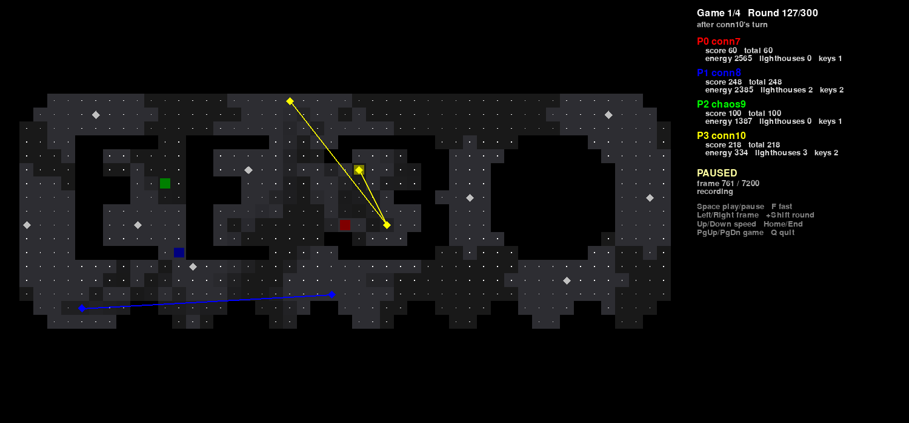

# Viewer

A pygame window for the C++ engine. It looks like the official
`engine/view.py`:

- cells shaded by their energy
- triangles tinted in their owner's colour
- lighthouses drawn as diamonds
- lasers drawn as lines
- players drawn as small squares



Each bot keeps its colour and its place in the panel in every game.
`game.py` rotates the bots between games, so the official viewer, which
colours by player number, changed every bot's colour at each new game.

A side panel shows, for each bot, its name, game score, total score across
the rotated games, energy, lighthouses owned and keys held.

Needs pygame (`pip install pygame`). The board's triangle cells are computed
with the official `engine/geom.py`.

## Watch live

```sh
./build/lighthouses --view maps/island.txt 'bot0 cmd' 'bot1 cmd'
```

The viewer sets the pace. After every frame the engine waits until the
viewer asks for the next one, so pausing the viewer pauses the game between
turns. A frame is a round start, a bot's turn or a round end. Bots are only
timed while they think, so pausing never makes one time out.

If you quit the viewer, the engine finishes the games headless. stdout is
the same with or without the viewer.

To start the viewer with other options, pass the command yourself:

```sh
./build/lighthouses --view --viewer 'python3 viewer/viewer.py --live --paused' ...
```

## Record and watch later

```sh
./build/lighthouses --record game.jsonl.gz maps/island.txt 'bot0 cmd' 'bot1 cmd'
python3 viewer/viewer.py game.jsonl.gz
```

The recording is JSON Lines, one frame per line. A name ending in `.gz` is
gzip-compressed. A 4-bot run of 4 games × 1200 rounds is about 1 MB
compressed, or 18 MB without `.gz`. Recording costs a few percent of engine
speed. With neither `--record` nor `--view`, the engine does no viewer work
at all.

## Keys

| key | action |
|---|---|
| Space | play / pause |
| Right, Left | one frame forward / back |
| Shift + Right / Left | one round forward / back |
| Up, Down | faster / slower: 1, 2, 5, 10, 15, 25, 50 or 100 rounds/s. The default, 15, is about the pace of the official engine's window |
| F | fast: in live mode, follows the engine as fast as the bots answer; in a recording, plays at maximum speed |
| Home, End | first / last frame |
| PgUp, PgDn | previous / next game |
| Q, Esc | quit |

In live mode every frame is kept, so you can step back through history
while the engine waits.

## Options

| option | meaning |
|---|---|
| `--speed N` | initial speed in rounds/s (default 15) |
| `--paused` | start paused |
| `--fast` | start in fast mode |
| `--exit-at-end` | close the window after the last frame |
| `--size WxH` | window size (default 1400x800); the window can be resized |
| `--screenshot FRAME PNG` | render one frame of a recording to a PNG and exit; a negative FRAME counts from the end |

## Frame format

Each line is one JSON object, of one of three types:

| `type` | when | contents |
|---|---|---|
| `game` | once per game, after the bots greet | `island`, `lighthouses`, `names`, `slots` (each player's position on the command line), `cumulative` (scores so far), `game`, `games`, `rounds` |
| `frame` | after each pre_round (`"phase": "pre"`), each bot's turn (`"turn"`, with `player`) and each post_round (`"post"`) | lighthouse `[owner, energy]` list, connections and triangles as lighthouse indices, players as `[x, y, score, energy, keys, alive]` |
| `end` | after the last game | final `scores` |

`frame` lines carry the cell `energy` grid only on `pre` frames, because
that is the only time it changes.
